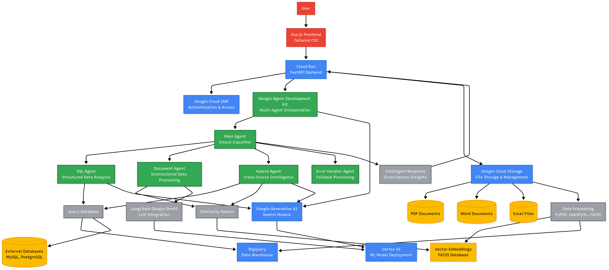

# OmniQuery

**Data Analysis and Insights - Agent Development Kit Hackathon with Google Cloud**  

---

## System Flow Diagram


*High-level architecture and agent workflow for OmniQuery.*

---

OmniQuery is an intelligent multi-agent system that autonomously analyzes data from diverse sources - structured databases, uploaded files (PDF, Word, Excel, CSV), and external database connections. The system extracts meaningful insights and collaboratively presents findings through natural language interaction. Built with Google's Agent Development Kit (ADK) and hosted on Google Cloud Platform.

##  Features
- **Autonomous Data Analysis**: Multi-agent system that independently analyzes data from various sources
- **Universal File Support**: Upload and analyze PDF, Word (.doc, .docx), Excel (.xlsx), and CSV files
- **Database Connectivity**: Connect to external databases (MySQL, PostgreSQL, SQL Server, etc.)
- **Intelligent Source Selection**: Automatically identifies the best data source(s) for each query
- **Cross-Source Intelligence**: Combines structured and unstructured data for comprehensive insights
- **Schema Intelligence**: Automatically understands data structure with optional user-provided column descriptions
- **Smart Data Routing**: Routes queries to appropriate agents based on data type and analysis requirements
- **Collaborative Findings Presentation**: Agents work together to synthesize insights from multiple sources
- **Real-time Analytics**: Generate on-demand analysis, trends, and visualizations
- **Natural Language Interface**: Interact with all your data using conversational queries
- **Cloud-Native Architecture**: Fully hosted on Google Cloud with scalable data processing
- **Metadata Management**: Add custom descriptions and context for better data understanding

## Architecture

```
OmniQuery/
├── app.py                  # Main FastAPI application
├── utils.py               # Utility functions and helpers
├── test/                  # Testing and agent modules
│   ├── sub_agents/
│   │   ├── document_agent/     # Analyzes PDF documents for insights
│   │   ├── error_handler_agent/ # Manages fallback analysis scenarios
│   │   ├── hybrid_agent/       # Cross-source data analysis
│   │   └── sql_agent/          # BigQuery data analysis and insights
│   └── ...
├── requirements.txt       # Dependencies
└── README.md
```

### Data Analysis Workflow
1. **Data Ingestion** → Multiple sources (BigQuery, files, documents) feed into the system
2. **Intent Classification** → Determines analysis type (statistical, trend, comparative, hybrid)
3. **Collaborative Analysis** → Specialized agents work together to derive insights
4. **Insight Synthesis** → Agents collaborate to present comprehensive findings
5. **Intelligent Presentation** → Natural language summaries with actionable insights

## Technology Stack

- **Google Agent Development Kit (ADK)** - Multi-agent orchestration
- **Google Cloud Platform** - Infrastructure and hosting
- **BigQuery** - Primary data warehouse for analysis
- **Google Cloud Storage** - Universal file storage (PDF, Word, Excel, CSV)
- **Vertex AI** - Large language model integration
- **Database Connectors** - MySQL, PostgreSQL, SQL Server, Oracle connectivity
- **Document Processing** - PDF, Word (.doc, .docx) text extraction and analysis
- **FAISS** - Vector similarity search for unstructured data
- **Pandas/PyArrow** - Structured data processing and schema detection
- **FastAPI** - REST API backend
- **Vue.js** - Frontend interface

##  Data Analysis Examples

### Cross-Format Analysis
```
"Analyze sales trends from Excel files and compare with customer feedback in Word documents"
"What insights can we derive from combining database records with PDF reports?"
"Find correlations between survey data (CSV) and policy documents (PDF)"
```

### Intelligent Source Selection  
```
"Show me customer satisfaction trends" → Auto-selects survey CSV + feedback PDFs
"Analyze Q4 performance" → Combines database tables + Excel reports + Word summaries
"What are the compliance issues?" → Searches Word docs + PDF regulations + database logs
```

### Schema-Aware Queries
```
"Compare revenue by region" → Understands 'revenue' and 'region' columns across sources
"Analyze customer churn patterns" → Maps customer IDs across database and files
"What factors affect product success?" → Combines sales data + review documents
```

### Multi-Source Intelligence
```
"Generate a comprehensive business report using all available data"
"Identify discrepancies between financial records and audit documents"
"Predict market trends using historical data and industry reports"
```

### File Upload & Data Sources
- **Unstructured Data**: PDF, Word (.doc, .docx) documents automatically processed and indexed
- **Structured Data**: Excel (.xlsx), CSV files imported to BigQuery with schema detection
- **Database Integration**: Connect MySQL, PostgreSQL, SQL Server, Oracle databases
- **Metadata Enhancement**: Add column descriptions and context for better analysis
- **Auto-Schema Detection**: Intelligent data type recognition and relationship mapping


##  Agent Details

**SQL Agent**: Performs multi-source structured data analysis across BigQuery and connected databases
**Document Agent**: Extracts insights from PDF, Word documents using semantic understanding  
**Hybrid Agent**: Combines structured and unstructured data analysis for comprehensive intelligence  
**Error Handler**: Provides alternative analysis approaches and source recommendations

Each agent intelligently selects the most relevant data sources and collaborates to provide comprehensive, cross-format insights.

##  Hackathon Submission - Data Analysis and Insights

This project exemplifies the **Data Analysis and Insights** theme by creating a sophisticated multi-agent system that:

- **Universal Data Integration**: Seamlessly connects structured databases, unstructured documents (PDF, Word), and spreadsheets (Excel, CSV)
- **Autonomous Source Intelligence**: Agents automatically identify and select the most relevant data sources for each analysis
- **Cross-Format Analytics**: Derives insights by combining information from databases, documents, and files
- **Schema-Aware Processing**: Intelligently understands data relationships across different formats and sources
- **Collaborative Intelligence**: Multiple agents work together to synthesize comprehensive findings from diverse data types
- **BigQuery Integration**: Leverages Google Cloud's powerful analytics engine for scalable data processing
- **Natural Language Interface**: Makes complex multi-source data analysis accessible through conversation

**Key Innovation**: True universal data analysis that breaks down silos between structured databases, unstructured documents, and spreadsheet data, enabling comprehensive business intelligence through collaborative AI agents.


**Built for the Agent Development Kit Hackathon with Google Cloud**

---

## Screenshots


*Conversational interface for querying and analyzing data.*


*View and manage structured data sources and query results.*


*Upload and process Excel files for analysis.*


*Analyze and extract insights from PDF and Word documents.*


*Generate and view presentation-ready insights and summaries.*


*Information and help page for users.*

---

## How to Use OmniQuery

### Live Demo
**Access the application:** https://adk-trial-289215770101.asia-south1.run.app/

---

### Quick Start Guide
#### 1. Access the Application
- Open the URL in your web browser
- You'll see the OmniQuery interface with upload areas and a query box

#### 2. Login as Admin
- Click **"Login"** or **"Admin Panel"**
- Enter credentials:
  - **Username:** `admin`
  - **Password:** `123456`
- Click **"Login"**

#### 3. Upload Your Data
**Upload Documents (PDFs, Word files):**
- Click **"Upload Documents"** section
- Drag & drop or select your files:
  - Business reports, contracts, research papers
  - Meeting notes, policy documents
  - Any PDF or Word documents you want to analyze
- Wait for upload confirmation

**Upload Structured Data (Excel, CSV):**
- Click **"Upload Structured Data"** section  
- Upload your spreadsheets:
  - Sales data, customer records, financial data
  - Survey responses, analytics reports
  - Any Excel or CSV files with your data
- Files automatically convert to queryable format

#### 4. Ask Questions
- Use the main query box to ask questions about your data in plain English
- The AI will automatically analyze and combine insights from all your uploaded sources

---

### Example Question Types
**Analyze Your Documents:**
- "What are the key findings from my reports?"
- "Summarize the main points from the contracts"
- "What insights can you extract from the uploaded documents?"

**Analyze Your Data:**
- "What are the trends in my data?"
- "Show me the top performing items"
- "What patterns do you see in the numbers?"

**Combine Everything:**
- "How does the data correlate with what's mentioned in the documents?"
- "Give me a comprehensive analysis using all uploaded sources"
- "What recommendations can you make based on everything I've uploaded?"

---

## Ready to Test!
1. Go to: **https://adk-trial-289215770101.asia-south1.run.app/**
2. Login with the provided credentials
3. Upload your own documents and data files
4. Start asking questions about your data
5. Experience intelligent multi-source analysis powered by Google Agent Development Kit!